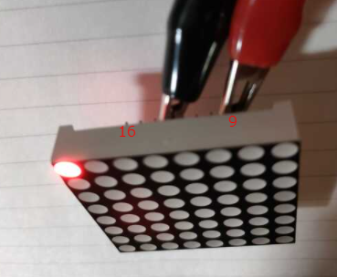
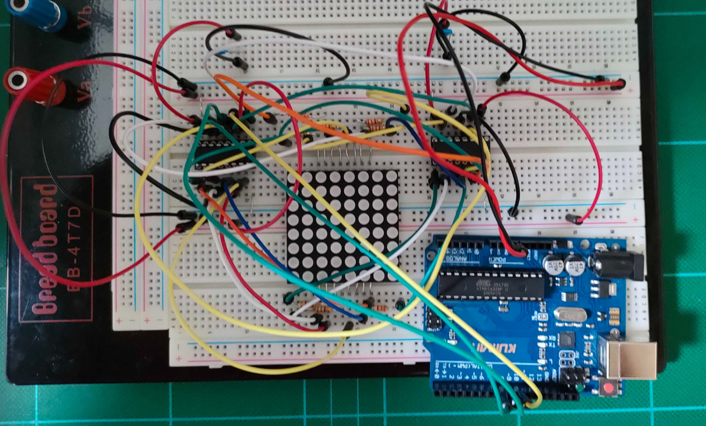
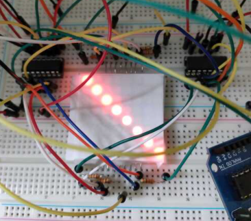

# これは何?

Kumanのキットについていた8x8 LEDで遊んでみた記録

動作確認←今ココ  
makeblockから操作  


# 8 x 8 LED

資料からわかることは、1588BSというものだった

Kumanのキットにはデータシートのようなものはついていなかった。


↓こんなかんじにLEDが（物理的に）配置されている

| ↓アノード/カソード→ | Col 1 | Col 2 | Col 3 | Col 4 | Col 5 | Col 6 | Col 7 | Col 8 |
|-----------|-------|-------|-------|-------|-------|-------|-------|-------|
| Row 1     | ○     | ○     | ○     | ○     | ○     | ○     | ○     | ○     |
| Row 2     | ○     | ○     | ○     | ○     | ○     | ○     | ○     | ○     |
| Row 3     | ○     | ○     | ○     | ○     | ○     | ○     | ○     | ○     |
| Row 4     | ○     | ○     | ○     | ○     | ○     | ○     | ○     | ○     |
| Row 5     | ○     | ○     | ○     | ○     | ○     | ○     | ○     | ○     |
| Row 6     | ○     | ○     | ○     | ○     | ○     | ○     | ○     | ○     |
| Row 7     | ○     | ○     | ○     | ○     | ○     | ○     | ○     | ○     |
| Row 8     | ○     | ○     | ○     | ○     | ○     | ○     | ○     | ○     |

Pinは16本しかないので（厳密に）同時に光らせることができるのは、8個のLED

それを高速に行うことで見た目にはずっと光って見えるようにする（残像を利用した）方式っぽい

Pin配置は下記だった

|Row/Col|Pin No|
|-----|-----|
|Row 1|Pin 9|
|Row 2|Pin 14|
|Row 3|Pin 8|
|Row 4|Pin 12|
|Row 5|Pin 1|
|Row 6|Pin 7|
|Row 7|Pin 2|
|Row 8|Pin 5|
|Col 1|Pin 13|
|Col 2|Pin 3|
|Col 3|Pin 4|
|Col 4|Pin 10|
|Col 5|Pin 6|
|Col 6|Pin 11|
|Col 7|Pin 15|
|Col 8|Pin 16|

アノード側をHigh、カソード側をLowにするとそれに対応するLEDが点灯する

1行目(Row 1)の1列目を点灯する場合、

Pin 9 = High, Pin 13= Lowで点灯する（ハズ）



あってる

# 配線

Pinの数が多いので、節約のため、シフトレジスタを使用
（そのほうがプログラム的にも楽だった）

74HC595（x 2）を準備した

カソード側に220Ωの抵抗を配置



TODO　あとで配線図を書く

# 動作確認

Arduino の IDEで動作確認してみた

```ino
const int PIN_SER   =  8;
const int PIN_LATCH =  9;
const int PIN_CLK   = 10;

byte column[8];

void setup() {
  pinMode( PIN_SER, OUTPUT );
  pinMode( PIN_LATCH, OUTPUT );
  pinMode( PIN_CLK, OUTPUT );

  //ここが表示するもの
  column[0]= 0x80;
  column[1]= 0x40;
  column[2]= 0x20;
  column[3]= 0x10;
  column[4]= 0x08;
  column[5]= 0x04;
  column[6]= 0x02;
  column[7]= 0x01;
  while(true){
    for(int i = 0; i < 8; i++){
      byte Row = 0;
      if(column[i]>0){
          Row = 1 << (8 - i -1);
      }
  
      digitalWrite( PIN_LATCH, LOW );
      shiftOut( PIN_SER, PIN_CLK, LSBFIRST, ~Row );
      shiftOut( PIN_SER, PIN_CLK, LSBFIRST, column[i] );
      digitalWrite( PIN_LATCH, HIGH );
    }
  }
  
}

void loop() {
}
```



まぶしいので紙をかぶせた


# wsl + vscode + arduino 

↓WSL2でUSBシリアル↓

https://qiita.com/baggio/items/28c13ed8ac09fc7ebdf1

usbipd-win + カーネルのリコンパイル

違い  
→USBが /dev/ttyACM0だった

/dev/ttyACM0はroot:rootだった  
→sudo usermod -a -G root axt  
↑rootグループに参加した  

WSL2再起動のたびに下記必要そう?

```
sudo chmod a+rw /dev/ttyACM0
```

Serialにインテリセンス効かなかった↓下記で解決

https://github.com/microsoft/vscode-arduino/issues/808

